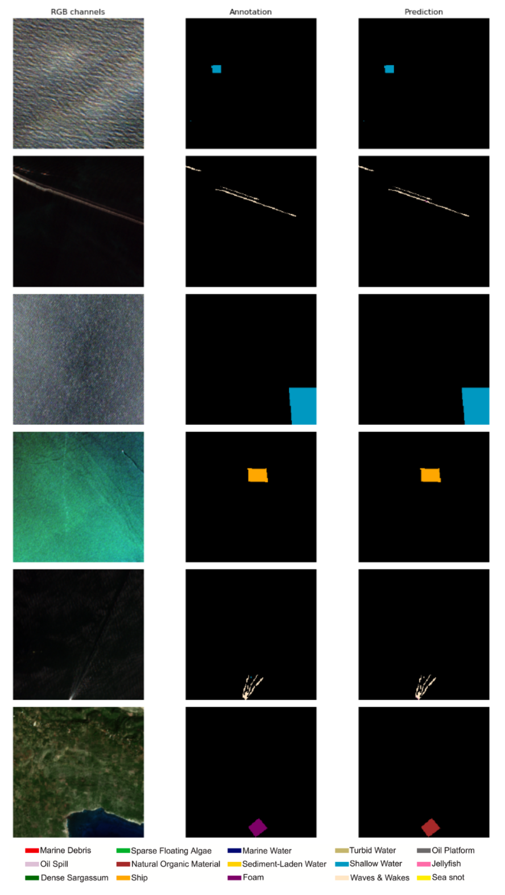

# Satellite ViT-Adapter
This repository is part of the Thesis work: Sky’s the Limit: Satellite Imagery Analysis with Image-level and Dense Self-Supervised Techniques.

In this repository, we provide the code that was used to perform dense fine-tuning with the ViT-Adapter and UPerNet on the DFC2020 and MADOS datasets.

## Abstract
The introduction of the Vision Transformer (ViT) has revolutionized the field of computer
vision, significantly advancing research in self-supervised learning (SSL). While SSL devel-
opments have predominantly focused on object-centric and RGB images, the application of
these methods to satellite imagery poses unique challenges due to substantial domain shifts.
This study explores the use of a plain ViT backbone for satellite image analysis as it presents
multiple advantages over its hierarchical version.
We investigated three SSL frameworks — DINO, Leopart, and ODIN — evaluating their
performance on satellite images. Our findings indicate that pretraining on satellite images
provides a substantial advantage over object-centric RGB images, underscoring the value
of domain-specific pretraining. We observed that advanced dense SSL algorithms did not
consistently outperform traditional image-level SSL frameworks, with fine-tuning results
highlighting limitations in the dense approach when adapted to a ViT backbone. Furthermore,
linear probing performance did not reliably predict fine-tuning outcomes, suggesting that
linear probing may not fully reflect real-world application performance.
Notably, the plain ViT backbone, when combined with our selected SSL frameworks, learned
powerful representations that outperformed recent benchmarks on the DFC2020 and MADOS
datasets. Future research could enhance this framework by integrating a ViT-Adapter with the
ODIN algorithm to improve object detection granularity and training efficiency. This approach
could also enable the ViT backbone to process multiple data modalities, offering promising
potential for further advancements in SSL. Additionally, integrating a Mask2Former decoder
with the ViT-Backbone for semantic segmentation could further improve performance in
instance, panoptic, and semantic segmentation, making the model more general and robust.

Full paper available upon request.

Author: *Amaudruz R.*

Supervisors: *Yuki A., Russwurm, M.*

## Acknowledgement
This project builds upon the work in the repository [Vision Transformer Adapter for Dense Predictions](https://github.com/czczup/ViT-Adapter). The original research was conducted by Zhe Chen, Yuchen Duan, Wenhai Wang, Junjun He, Tong Lu, Jifeng Dai, and Yu Qiao, as part of their study titled [Paper](https://arxiv.org/abs/2205.08534).
In addition, the evaluation code for MADOS was adapted from [mados](https://github.com/gkakogeorgiou/mados).

## Contributions
- [x] **Added new datasets**: Added support for both the DFC2020 and MADOS datasets.
- [x] **Data augmentations**: Added detailed analysis of test performance for MADOS dataset.

## Visualisations
Samples from the [MADOS dataset](https://github.com/gkakogeorgiou/mados), along with labels and predictions:

## Installation
We add conda yaml files to set up the Python environment under the [installation directory](https://github.com/RyanAmaudruz/SatelliteVitAdapter/tree/main/installation).

## Scripts
- [ViT-Adapter Script](https://github.com/RyanAmaudruz/SatelliteVitAdapter/tree/main/snellius/train_vit_adapter_das4.sh): Semantic segmentation with ViT-Adapter + UPerNet.
- [MADOS eval Script](https://github.com/RyanAmaudruz/SatelliteVitAdapter/tree/main/snellius/eval_mados_vit_adapter_das4.sh): MADOS dataset test set detailed evaluation.

- snellius/train_vit_adapter_das4.sh
SatelliteVitAdapter/snellius
/eval_mados_vit_adapter_das4.sh

## License

This repository is released under the Apache 2.0 license as found in the [LICENSE](LICENSE.md) file.
